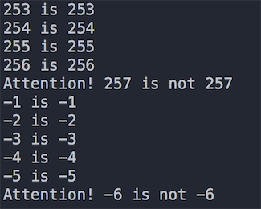
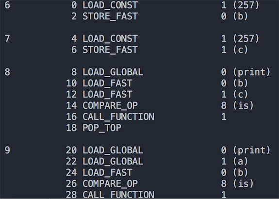
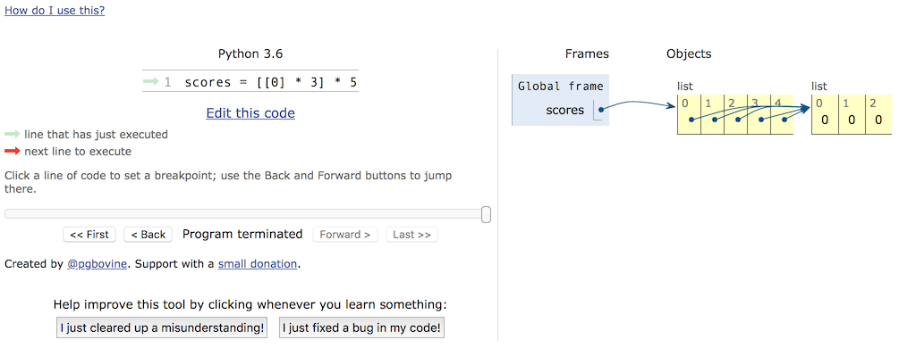
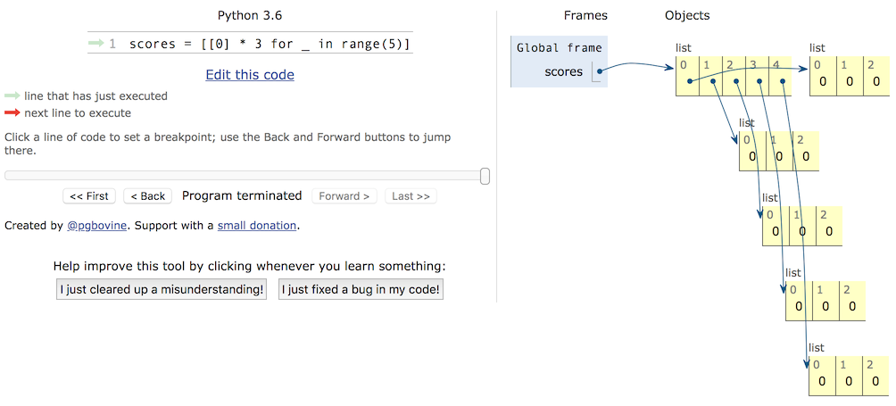

## 那些年我们踩过的那些坑

### 坑 1 - 整数比较的坑

在 Python 中一切都是对象，整数也是对象，在比较两个整数时有两个运算符`==`和`is`，它们的区别是：

- `is`比较的是两个整数对象的 id 值是否相等，也就是比较两个引用是否代表了内存中同一个地址。
- `==`比较的是两个整数对象的内容是否相等，使用`==`时其实是调用了对象的`__eq__()`方法。

知道了`is`和`==`的区别之后，我们可以来看看下面的代码，了解 Python 中整数比较有哪些坑，**以 CPython 解释器为例**，大家先看看下面的代码。

```Python
def main():
	x = y = -1
	while True:
		x += 1
		y += 1
		if x is y:
			print('%d is %d' % (x, y))
		else:
			print('Attention! %d is not %d' % (x, y))
			break

	x = y = 0
	while True:
		x -= 1
		y -= 1
		if x is y:
			print('%d is %d' % (x, y))
		else:
			print('Attention! %d is not %d' % (x, y))
			break


if __name__ == '__main__':
	main()
```

上面代码的部分运行结果如下图所示。这个结果是因为 CPython 出于性能优化的考虑，把频繁使用的整数对象用一个叫`small_ints`的对象池缓存起来造成的。`small_ints`缓存的整数值被设定为`[-5, 256]`这个区间，也就是说，如果使用 CPython 解释器，在任何引用这些整数的地方，都不需要重新创建`int`对象，而是直接引用缓存池中的对象。如果整数不在该范围内，那么即便两个整数的值相同，它们也是不同的对象。



当然仅仅如此这个坑就不值一提了，如果你理解了上面的规则，我们就再看看下面的代码。

```Python
a = 257


def main():
	b = 257  # 第6行
	c = 257  # 第7行
	print(b is c)  # True
	print(a is b)  # False
	print(a is c)  # False


if __name__ == "__main__":
	main()
```

程序的执行结果已经用注释写在代码上了。够坑吧！看上去`a`、`b`和`c`的值都是一样的，但是`is`运算的结果却不一样。为什么会出现这样的结果，首先我们来说说 Python 程序中的代码块。所谓代码块是程序的一个最小的基本执行单位，一个模块文件、一个函数体、一个类、交互式命令中的单行代码都叫做一个代码块。上面的代码由两个代码块构成，`a = 257`是一个代码块，`main`函数是另外一个代码块。CPython 底层为了进一步提升性能还做了一个设定：对于同一个代码块中值不在`small_ints`缓存范围之内的整数，如果同一个代码块中已经存在一个值与其相同的整数对象，那么就直接引用该对象，否则创建新的`int`对象。需要大家注意的是，这条规则对数值型适用，但对字符串则需要考虑字符串的长度，这一点可以自行证明。
为了验证刚刚的结论，我们可以借用`dis`模块（听名字就知道是进行反汇编的模块）从字节码的角度来看看这段代码。如果不理解什么是字节码，可以先看看[《谈谈 Python 程序的运行原理》](<(http://www.cnblogs.com/restran/p/4903056.html)>)这篇文章。可以先用`import dis`导入`dis`模块并按照如下所示的方式修改代码。

```Python
import dis

dis.dis(main)
```

代码的执行结果如下图所示。可以看出代码第 6 行和第 7 行，也就是`main`函数中的 257 是从同一个位置加载的，因此是同一个对象；而代码第 9 行的`a`明显是从不同的地方加载的，因此引用的是不同的对象。



如果还想对这个问题进行进一步深挖，推荐大家阅读[《Python 整数对象实现原理》](https://foofish.net/python_int_implement.html)这篇文章。

### 坑 2 - 嵌套列表的坑

Python 中有一种内置的数据类型叫列表，它是一种容器，可以用来承载其他的对象（准确的说是其他对象的引用），列表中的对象可以称为列表的元素，很明显我们可以把列表作为列表中的元素，这就是所谓的嵌套列表。嵌套列表可以模拟出现实中的表格、矩阵、2D 游戏的地图（如植物大战僵尸的花园）、棋盘（如国际象棋、黑白棋）等。但是在使用嵌套的列表时要小心，否则很可能遭遇非常尴尬的情况，下面是一个小例子。

```Python
names = ['关羽', '张飞', '赵云', '马超', '黄忠']
subjs = ['语文', '数学', '英语']
scores = [[0] * 3] * 5
for row, name in enumerate(names):
    print('请输入%s的成绩' % name)
    for col, subj in enumerate(subjs):
        scores[row][col] = float(input(subj + ': '))
        print(scores)
```

我们希望录入 5 个学生 3 门课程的成绩，于是定义了一个有 5 个元素的列表，而列表中的每个元素又是一个由 3 个元素构成的列表，这样一个列表的列表刚好跟一个表格是一致的，相当于有 5 行 3 列，接下来我们通过嵌套的 for-in 循环输入每个学生 3 门课程的成绩。程序执行完成后我们发现，每个学生 3 门课程的成绩是一模一样的，而且就是最后录入的那个学生的成绩。

要想把这个坑填平，我们首先要区分对象和对象的引用这两个概念，而要区分这两个概念，还得先说说内存中的栈和堆。我们经常会听人说起“堆栈”这个词，但实际上“堆”和“栈”是两个不同的概念。众所周知，一个程序运行时需要占用一些内存空间来存储数据和代码，那么这些内存从逻辑上又可以做进一步的划分。对底层语言（如 C 语言）有所了解的程序员大都知道，程序中可以使用的内存从逻辑上可以为五个部分，按照地址从高到低依次是：栈（stack）、堆（heap）、数据段（data segment）、只读数据段（static area）和代码段（code segment）。其中，栈用来存储局部、临时变量，以及函数调用时保存现场和恢复现场需要用到的数据，这部分内存在代码块开始执行时自动分配，代码块执行结束时自动释放，通常由编译器自动管理；堆的大小不固定，可以动态的分配和回收，因此如果程序中有大量的数据需要处理，这些数据通常都放在堆上，如果堆空间没有正确的被释放会引发内存泄露的问题，而像 Python、Java 等编程语言都使用了垃圾回收机制来实现自动化的内存管理（自动回收不再使用的堆空间）。所以下面的代码中，变量`a`并不是真正的对象，它是对象的引用，相当于记录了对象在堆空间的地址，通过这个地址我们可以访问到对应的对象；同理，变量`b`是列表容器的引用，它引用了堆空间上的列表容器，而列表容器中并没有保存真正的对象，它保存的也仅仅是对象的引用。

```Python
a = object()
b = ['apple', 'pitaya', 'grape']
```

知道了这一点，我们可以回过头看看刚才的程序，我们对列表进行`[[0] * 3] * 5`操作时，仅仅是将`[0, 0, 0]`这个列表的地址进行了复制，并没有创建新的列表对象，所以容器中虽然有 5 个元素，但是这 5 个元素引用了同一个列表对象，这一点可以通过`id`函数检查`scores[0]`和`scores[1]`的地址得到证实。所以正确的代码应该按照如下的方式进行修改。

```Python
names = ['关羽', '张飞', '赵云', '马超', '黄忠']
subjs = ['语文', '数学', '英语']
scores = [[]] * 5
for row, name in enumerate(names):
    print('请输入%s的成绩' % name)
    scores[row] = [0] * 3
    for col, subj in enumerate(subjs):
        scores[row][col] = float(input(subj + ': '))
        print(scores)
```

或者

```Python
names = ['关羽', '张飞', '赵云', '马超', '黄忠']
subjs = ['语文', '数学', '英语']
scores = [[0] * 3 for _ in range(5)]
for row, name in enumerate(names):
    print('请输入%s的成绩' % name)
    scores[row] = [0] * 3
    for col, subj in enumerate(subjs):
        scores[row][col] = float(input(subj + ': '))
        print(scores)
```

如果对内存的使用不是很理解，可以看看[PythonTutor 网站](http://www.pythontutor.com/)上提供的代码可视化执行功能，通过可视化执行，我们可以看到内存是如何分配的，从而避免在使用嵌套列表或者复制对象时可能遇到的坑。





### 坑 3 - 访问修饰符的坑

用 Python 做过面向对象编程的人都知道，Python 的类提供了两种访问控制权限，一种是公开，一种是私有（在属性或方法前加上双下划线）。而用惯了 Java 或 C#这类编程语言的人都知道，类中的属性（数据抽象）通常都是私有的，其目的是为了将数据保护起来；而类中的方法（行为抽象）通常都是公开的，因为方法是对象向外界提供的服务。但是 Python 并没有从语法层面确保私有成员的私密性，因为它只是对类中所谓的私有成员进行了命名的变换，如果知道命名的规则照样可以直接访问私有成员，请看下面的代码。

```Python
class Student(object):

    def __init__(self, name, age):
        self.__name = name
        self.__age = age

    def __str__(self):
        return self.__name + ': ' + str(self.__age)


stu = Student('BDFD', 38)
print(stu._Student__name)
print(stu._Student__age)
```

Python 为什么要做出这样的设定呢？用一句广为流传的格言来解释这个问题：“We are all consenting adults here”（我们都是成年人）。这句话表达了很多 Python 程序员的一个共同观点，那就是开放比封闭要好，我们应该自己对自己的行为负责而不是从语言层面来限制对数据或方法的访问。

所以在 Python 中我们实在没有必要将类中的属性或方法用双下划线开头的命名处理成私有的成员，因为这并没有任何实际的意义。如果想对属性或方法进行保护，我们建议用单下划线开头的受保护成员，虽然它也不能真正保护这些属性或方法，但是它相当于给调用者一个暗示，让调用者知道这是不应该直接访问的属性或方法，而且这样做并不影响子类去继承这些东西。

需要提醒大家注意的是，Python 类中的那些魔法方法，如`__str__`、`__repr__`等，这些方法并不是私有成员哦，虽然它们以双下划线开头，但是他们也是以双下划线结尾的，这种命名并不是私有成员的命名，这一点对初学者来说真的很坑。
